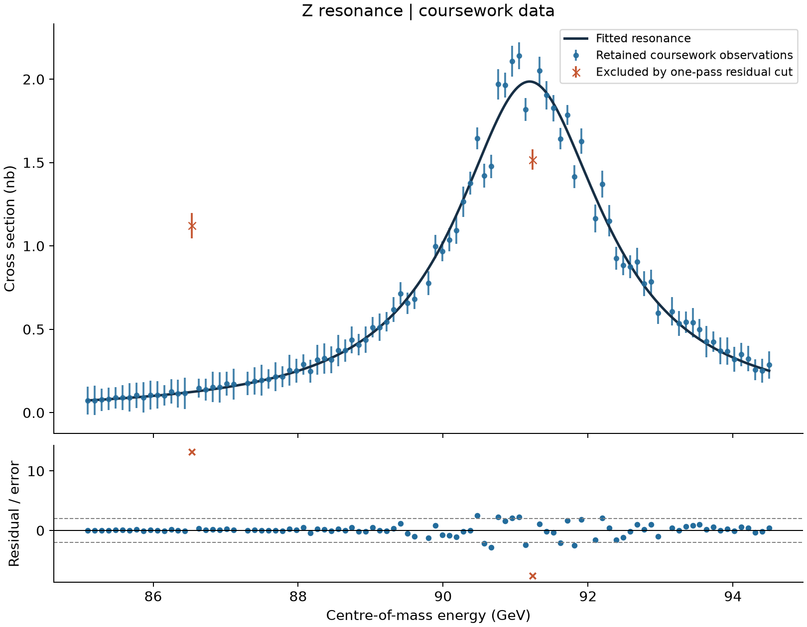
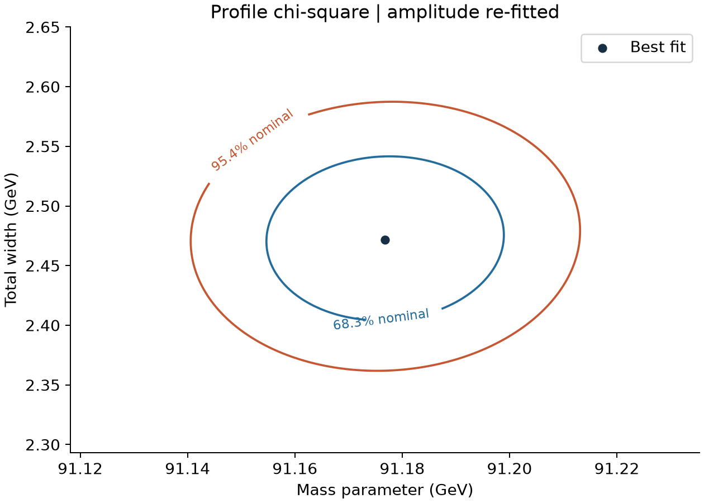

# Z Boson Resonance Fit

**A reproducible physics-data analysis: resonance fitting, uncertainty estimation, and transparent outlier diagnostics.**

Python · NumPy · SciPy · weighted nonlinear least squares · profile chi-square



How can a resonance curve reveal a particle's mass and lifetime? This project fits a Breit–Wigner-type line shape to two supplied undergraduate coursework CSVs. It estimates a mass parameter, total width and cross-section normalization, then converts the width to a lifetime.

Developed from Ruijia Liu's 2025 PHYS10362 analysis. The public version corrects the lifetime units, makes the amplitude definition explicit, and adds reproducible diagnostics. See [provenance and changes](docs/PROVENANCE.md).

## Results

| Quantity | Estimate | Local standard error |
|---|---:|---:|
| Mass parameter | 91.1768 GeV | 0.0147 GeV |
| Total width | 2.4718 GeV | 0.0446 GeV |
| Cross section at the fitted mass | 1.9856 nb | 0.0255 nb |
| Lifetime | 2.6629 × 10⁻²⁵ s | 0.0481 × 10⁻²⁵ s |

The default workflow retains **93 of 103 rows**: eight fail validity checks or the inherited coursework windows, and two are removed by a single 5σ pre-fit residual cut. The final χ² is 86.376 for 90 degrees of freedom (χ²/dof = 0.960).

The result depends on selection. Before the residual cut, the width is 2.5872 ± 0.0458 GeV and χ²/dof = 3.363. Both fits are saved in [fit_results.json](results/fit_results.json); every row and exclusion reason appears in [row_audit.csv](results/row_audit.csv). A lower χ² after clipping is not independent evidence that the exclusions are justified.

These are estimates for an educational dataset and simplified model, not a new experimental measurement. The CSVs do not identify a detector or establish whether the values are simulated. Quoted errors condition on the selected rows and supplied independent Gaussian errors; they exclude model, calibration and selection uncertainty.

## Run

Python 3.12 was used for the included results. From this repository:

```sh
python -m venv .venv
```

Activate with `.venv\Scripts\Activate.ps1` in Windows PowerShell, or `source .venv/bin/activate` on macOS/Linux. Then:

```sh
python -m pip install -r requirements.txt
python -m unittest -v
python analysis.py
```

The script reads the included CSVs, regenerates both figures, and exports results plus a row audit. Paths default to this repository, so execution does not depend on the working directory. Existing result files are overwritten. Exact tested direct dependency versions are in [requirements-tested.txt](requirements-tested.txt).

To inspect the influence of residual clipping, save a separate run:

```sh
python analysis.py --no-clip --output results_no_clip
```

`--no-clip` keeps the input validity checks and coursework windows. To supply other CSVs with the same three-column header and energy/cross-section/error units:

```sh
python analysis.py --data path/to/first.csv path/to/second.csv --output my_results
```

The 85–95 GeV and 0–3 nb coursework windows remain in effect; this is not a general-purpose resonance fitter.

## What is checked

- The model equals its fitted normalization at the mass parameter.
- The lifetime conversion gives the expected GeV-to-seconds scale.
- A noiseless synthetic curve recovers its known parameters.
- The profiled amplitude gives zero mismatch for a known exact curve.
- Invalid rows are recorded, and insufficient data fail explicitly.

All five test methods and the complete default run passed during preparation.



The normalization is re-fitted at every mass/width grid point. Contours use Δχ² = 2.30 and 6.18, relative to the optimized fit, and represent nominal two-parameter coverage under the model assumptions. Selection by residuals is not included in those coverage claims.

## Files

```text
analysis.py                Input audit, fit, lifetime, profiles and CLI
test_analysis.py           Physical and numerical checks
data/                     Two original coursework CSVs and source notes
results/                  Executed figures, numerical results and row audit
docs/METHODS.md            Model, units, selection and uncertainty
docs/PROVENANCE.md         Original work and preparation changes
requirements*.txt          Dependencies and tested versions
```

Original submission scripts, student account identifiers and obsolete plots are retained only in the owner's local archive. No course brief or marking scheme is included. No blanket license is assigned to the supplied coursework data.
